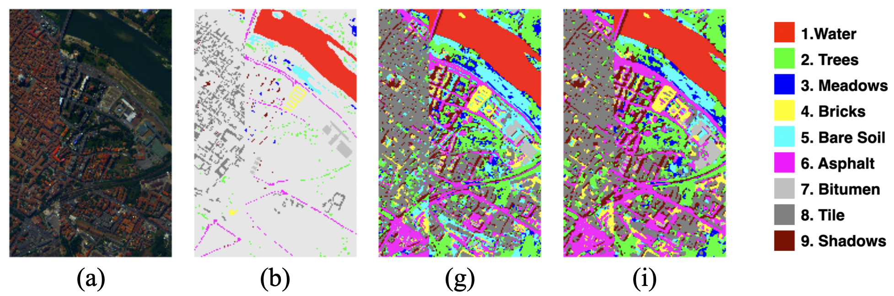

# PyTorch Implementation of SSTN for Hyperspectral Image Classification

Paper links: [SSTN published on IEEE T-GRS](https://www.researchgate.net/publication/355117935_Spectral-Spatial_Transformer_Network_for_Hyperspectral_Image_Classification_A_Factorized_Architecture_Search_Framework). Code download link: [SSTN code](https://github.com/zilongzhong/SSTN/archive/refs/heads/main.zip).

Here is the bibliography info:

<br/>

```jason
Zilong Zhong, Ying Li, Lingfei Ma, Jonathan Li, Wei-Shi Zheng. "Spectral-Spatial Transformer 
Network for Hyperspectral Image Classification: A Factorized Architecture Search Framework.” 
IEEE Transactions on Geoscience and Remote Sensing, DOI:10.1109/TGRS.2021.3115699,2021.
```
## Description
Neural networks have dominated the research of hyperspectral image classification, attributing to the feature learning capacity of convolution operations. However, the fixed geometric structure of convolution kernels hinders long-range interaction between features from distant locations.  In this work, we propose a novel spectral-spatial transformer network (SSTN), which consists of spatial attention and spectral association modules, to overcome the constraints of convolution kernels. Extensive experiments conducted on three popular hyperspectral image benchmarks demonstrate the versatility of SSTNs over other state-of-the-art (SOTA) methods. 


Fig.1 Spectral-Spatial Transformer Network (**SSTN**) with the architecture of 'AEAE', in which 'A' and 'E' stand for a spatial attention block and a spectral association block, respectively. (a) Search space for unit setting. (b) Search space for block sequence.


Fig.2 Illustration of spatial attention module (left) and spectral association module (right). The attention maps **Attn** in the spatial attention module
is produced by multiplying two reshaped tensors **Q** and **K**. Instead, the attention maps **M1** and **M2** in the spectral association module are the direct output of a convolution operation. The spectral association kernels **Asso** represent a compact set of spectral vectors used to reconstruct input feature **X**.

## Prerequisites

- [Miniconda3](https://docs.conda.io/en/latest/miniconda.html)
- [PyTorch 1.4+](https://github.com/tensorflow/tensorflow/tree/r1.3)

When you create a conda environment, check you have installed the packages in the [package-list](https://github.com/zilongzhong/SSTN-nov/blob/master/package_list.txt). You can also refer to the [managing environments](https://conda.io/docs/user-guide/tasks/manage-environments.html) of conda.

## Usage

HSI data can be downloaded from this website [HyperspectralData](http://www.ehu.eus/ccwintco/index.php/Hyperspectral_Remote_Sensing_Scenes). Before running the following commands, please make sure the datasets has been put in the dataset folder. For example,./dataset/PC/Pavia_gt.mat and ./dataset/PC/Pavia.mat

Train SSTNs with widely studied hyperspectral imagery (HSI) datasets:
```bash
$ python train_PC.py
$ python train_IN.py
$ python train_UP.py

```

Train SSRNs with widely studied hyperspectral imagery (HSI) datasets:
```bash
$ python train_PC.py --model SSRN
$ python train_IN.py --model SSRN
$ python train_UP.py --model SSRN

```

Evaluate trained SSTNs and generate classification maps:
```bash
$ python test_IN.py
$ python test_UP.py
$ python test_PC.py

```
Evaluate trained SSRNs and generate classification maps:
```bash
$ python test_IN.py --model SSRN  
$ python test_UP.py --model SSRN
$ python test_PC.py --model SSRN

```

## Result of Pavia Center (PC) Dataset 


Fig.3 Classification maps of different models on the PC dataset. 

## Result of Indian Pines (IN) dataset


Fig.4 Classification maps of different models on the IN dataset. 

## Result of University of Pavia (UP) dataset


Fig.5 Classification maps of different models on the UP dataset. 

## Reference

Tensorflow implementation of SSRN can be found at [https://github.com/zilongzhong/SSRN](https://github.com/zilongzhong/SSRN).
